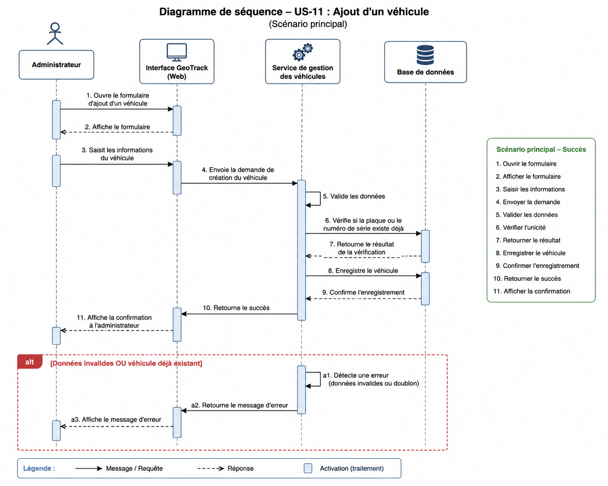

# US-11.2 — Diagramme de séquence : ajout d'un véhicule

## Objectif

Ce diagramme de séquence UML représente les interactions entre les différents composants du système GeoTrack lors de l'enregistrement d'un nouveau véhicule par un administrateur.

## Participants

- Administrateur
- Interface GeoTrack
- Service de gestion des véhicules
- Base de données

## Scénario principal

1. L'administrateur ouvre le formulaire d'ajout d'un véhicule.
2. L'interface GeoTrack affiche le formulaire.
3. L'administrateur saisit les informations du véhicule.
4. L'interface transmet la demande de création au service de gestion des véhicules.
5. Le service valide les données reçues.
6. Le service vérifie auprès de la base de données si la plaque d'immatriculation ou le numéro de série existe déjà.
7. La base de données retourne le résultat de la vérification.
8. Si le véhicule n'existe pas, le service demande son enregistrement.
9. La base de données confirme l'enregistrement.
10. Le service retourne le résultat à l'interface GeoTrack.
11. L'interface confirme à l'administrateur que le véhicule a été ajouté.

## Scénario alternatif

Si les données fournies sont invalides ou si la plaque d'immatriculation ou le numéro de série existe déjà :

1. Le service de gestion des véhicules détecte l'erreur.
2. Le service retourne un message d'erreur à l'interface GeoTrack.
3. L'interface affiche le message d'erreur à l'administrateur.
4. Le véhicule n'est pas enregistré.

## Diagramme UML

