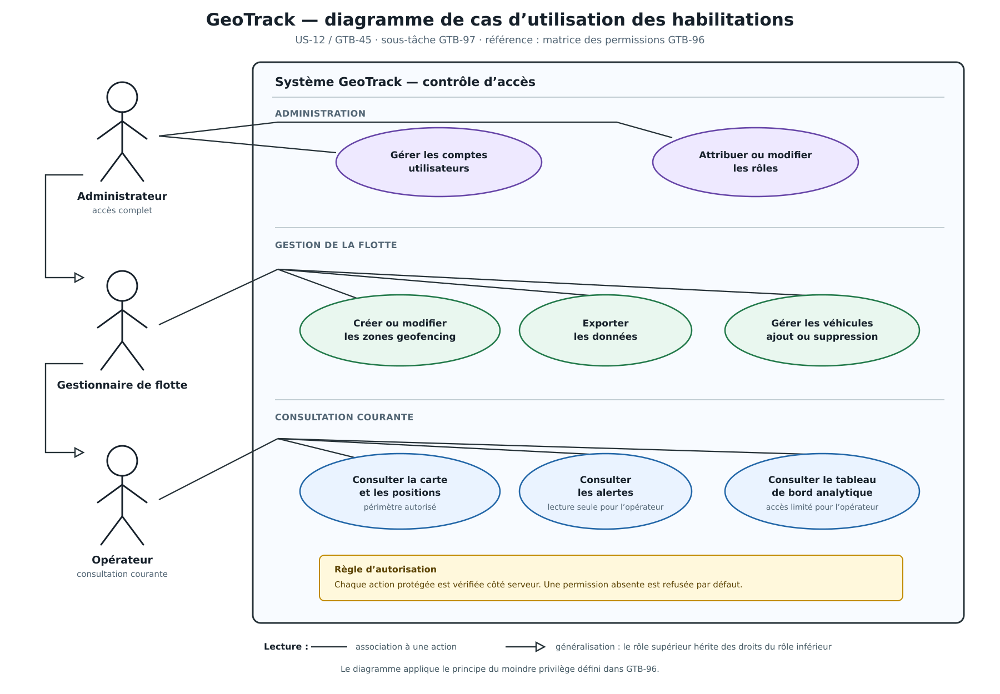

# US-12 / GTB-97 — Diagramme de cas d’utilisation des habilitations

## Traçabilité

| Élément | Référence |
|---|---|
| User Story | US-12 / GTB-45 |
| Sous-tâche | GTB-97 |
| Matrice de référence | GTB-96 |
| Type retenu | Diagramme de cas d’utilisation UML |
| Branche de travail | `feature/US-12-gestion-comptes-roles.2` |

## Choix de conception

Le diagramme de cas d’utilisation a été retenu parce qu’il permet de représenter directement les droits associés aux trois rôles de GeoTrack.

- L’**administrateur** est associé à la gestion des comptes et à l’attribution des rôles. Il hérite aussi des actions des autres rôles par généralisation UML.
- Le **gestionnaire de flotte** dispose des droits opérationnels sur les zones geofencing, les alertes, les rapports, les données et les véhicules.
- L’**opérateur** dispose de droits de consultation limités : carte et positions de son périmètre, alertes en lecture seule et tableau de bord limité.
- Une note UML rappelle que les actions protégées doivent être vérifiées côté serveur et qu’une permission absente est refusée par défaut.

## Diagramme

La version vectorielle est également fournie : [US-12-diagramme-cas-utilisation-habilitations.svg](US-12-diagramme-cas-utilisation-habilitations.svg).

## Correspondance avec GTB-96

| Élément de la matrice | Représentation dans le diagramme |
|---|---|
| Voir la carte / les positions | Cas « Consulter la carte et les positions » |
| Recevoir les alertes | Cas « Consulter les alertes »; restriction de lecture seule pour l’opérateur |
| Voir le tableau de bord analytique | Cas « Consulter le tableau de bord analytique »; accès limité pour l’opérateur |
| Créer / modifier les zones | Cas « Créer / modifier les zones geofencing » |
| Exporter les données | Cas « Exporter les données » |
| Gérer les véhicules | Cas « Gérer les véhicules » |
| Gérer les comptes utilisateurs | Cas « Gérer les comptes utilisateurs » |
| Attribuer les rôles | Cas « Attribuer / modifier les rôles » |

## Règle technique rappelée

Le diagramme ne remplace pas la vérification d’autorisation dans l’application. Chaque requête protégée doit vérifier la permission du rôle côté serveur, avec un refus par défaut si aucune permission correspondante n’est définie dans `role_permissions`.
