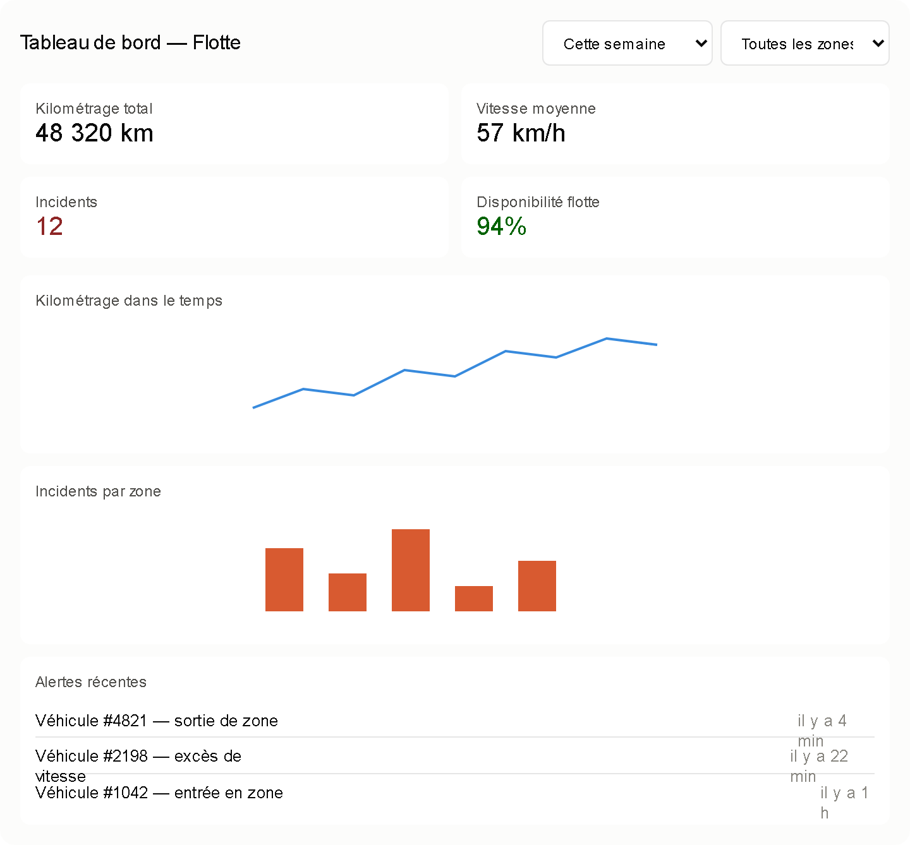

# US-10.2 — Conception du tableau de bord analytique

## Objectif

Documenter la conception du tableau de bord analytique GeoTrack destiné aux gestionnaires de flotte.

Cette conception s'appuie sur les indicateurs clés de performance définis dans US-10.1 / GTB-77 et sur la maquette réalisée dans le cadre de GTB-78.



## Structure du tableau de bord

Le tableau de bord est organisé afin de présenter en priorité les informations essentielles sur l'état de la flotte.

La structure retenue comprend :

1. des filtres de consultation ;
2. des cartes présentant les KPI principaux ;
3. des graphiques de tendance ;
4. une analyse des incidents ;
5. une section présentant les alertes récentes.

## Filtres

Le tableau de bord prévoit des filtres permettant d'adapter les informations affichées.

Les principaux filtres sont :

- période d'analyse ;
- véhicule ;
- zone de geofencing.

Les périodes peuvent notamment correspondre à :

- un jour ;
- une semaine ;
- un mois.

## KPI principaux

Les indicateurs essentiels sont positionnés dans la partie supérieure du tableau de bord afin d'être immédiatement visibles.

La maquette représente notamment :

- le kilométrage total ;
- la vitesse moyenne ;
- le nombre d'incidents ;
- le taux de disponibilité de la flotte.

Les valeurs présentes dans la maquette sont des données de démonstration destinées à illustrer l'organisation de l'interface.

## Kilométrage dans le temps

Un graphique en ligne permet de représenter l'évolution du kilométrage sur la période sélectionnée.

Cette représentation facilite l'identification :

- des tendances d'utilisation ;
- des variations d'activité ;
- des périodes de forte ou faible utilisation de la flotte.

## Incidents par zone

Un graphique en barres permet de représenter la répartition des incidents selon les zones.

Cette visualisation aide le gestionnaire à identifier rapidement les zones présentant un nombre important d'événements ou d'alertes.

## Alertes récentes

Une section dédiée présente les alertes et incidents récents.

Les événements affichés peuvent notamment concerner :

- une entrée dans une zone ;
- une sortie de zone ;
- un excès de vitesse ;
- un autre incident associé à un véhicule.

Cette section exploite les mécanismes d'alertes et de geofencing définis dans les autres composants de GeoTrack.

## Hiérarchie de l'information

La hiérarchie retenue est la suivante :

```text
Filtres
   |
   v
KPI principaux
   |
   v
Graphiques de tendance
   |
   v
Analyse des incidents
   |
   v
Alertes récentes
```

## Interactions

Un changement de filtre met à jour toutes les cartes et tous les graphiques. Un clic sur une zone ou un véhicule peut appliquer un filtre croisé, avec une action visible pour revenir à la vue complète.

Le tableau de bord distingue clairement : chargement, absence de données, erreur et résultat valide. La date de dernière mise à jour est toujours visible.

## Accessibilité et lisibilité

- La couleur n'est pas le seul porteur d'information.
- Les graphiques possèdent des titres, unités, légendes et valeurs accessibles.
- Les contrôles sont utilisables au clavier.
- Les contrastes et la taille du texte restent lisibles.
- Les libellés longs ne doivent pas être coupés ou se chevaucher.

## Performance

L'API renvoie des agrégats adaptés au graphique plutôt que toute la télémétrie brute. Les requêtes sont annulées ou remplacées lorsque l'utilisateur modifie rapidement les filtres. Un cache peut être utilisé pour les périodes fréquemment consultées, avec une durée explicite.

## Critères de validation

- Les filtres s'appliquent à l'ensemble du tableau de bord.
- Les unités et la période sont visibles.
- Les valeurs de la maquette sont identifiées comme démonstratives.
- Les états vide, chargement et erreur sont différents.
- Aucun libellé ni horodatage ne se chevauche à la largeur cible.
- Les données affichées respectent les droits de l'utilisateur.

## Conclusion

La conception privilégie une lecture rapide, des filtres cohérents et des états explicites. La maquette doit encore être ajustée visuellement pour éviter les coupures de libellés et les retours à la ligne observés dans l'export actuel.
