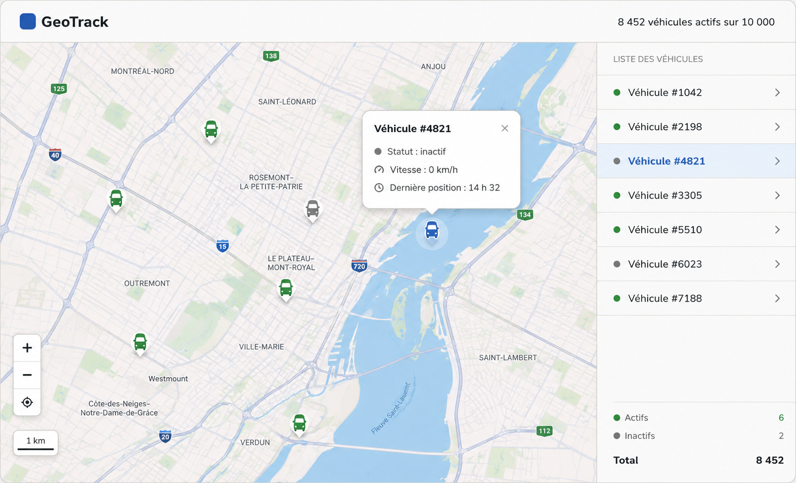

# US-04.2 — Maquette de l'interface principale GeoTrack

## Objectif

Documenter la maquette de l'interface principale de GeoTrack destinée à la visualisation et au suivi des véhicules sur une carte interactive.

Cette maquette correspond à la sous-tâche Jira **GTB-54**.

## Éléments de l'interface

L'écran principal est organisé autour de deux zones :

- une carte interactive occupant la partie principale de l'écran ;
- une liste des véhicules affichée dans un panneau latéral.

## Carte interactive

La carte permet de visualiser la position des véhicules de la flotte.

Les véhicules sont représentés par des marqueurs permettant d'identifier rapidement leur position et leur état.

Les contrôles de navigation permettent notamment :

- le zoom avant ;
- le zoom arrière ;
- le recentrage de la carte.

## État des véhicules

Un code visuel permet de différencier l'état des véhicules.

Les véhicules actifs sont représentés en vert tandis que les véhicules inactifs sont représentés en gris.

Le véhicule actuellement sélectionné peut être mis en évidence afin de faciliter son identification sur la carte et dans la liste.

## Liste des véhicules

Un panneau latéral présente les véhicules disponibles.

Chaque élément permet d'identifier un véhicule et son état.

La sélection d'un véhicule dans la liste permet de le retrouver plus facilement sur la carte.

## Panneau de détail

Lorsqu'un véhicule est sélectionné, une fiche d'information présente les données essentielles disponibles, notamment :

- l'identifiant du véhicule ;
- son statut ;
- sa vitesse ;
- l'heure de sa dernière position connue.

## Rafraîchissement

La conception de l'interface est compatible avec le mécanisme de rafraîchissement presque en temps réel défini dans US-02.

Les nouvelles positions peuvent être appliquées aux véhicules concernés sans nécessiter le rechargement complet de la carte.

## Bibliothèque cartographique

La maquette est cohérente avec le choix de **Leaflet** documenté dans US-04.

Leaflet est utilisé comme bibliothèque cartographique de référence pour l'implémentation de la carte interactive.

## Maquette associée

Le fichier image de la maquette est :

`US-04-interface-principale.png`

Il doit être conservé dans le même dossier que ce document :

`docs/maquettes/`

## Résultat attendu

La maquette fournit une représentation de référence de l'écran principal GeoTrack comprenant la carte interactive, les véhicules, leur état, la liste latérale et les informations détaillées du véhicule sélectionné.
